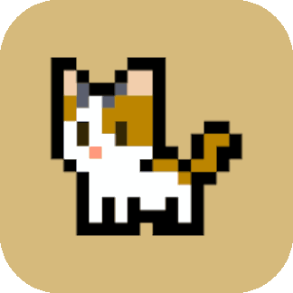

<h2 align="center">
  Send and Receive with Meowcoin's web wallet.
</h2>

---

 

## Be your own Bank

Meowcoin-Web-Wallet is a completely [non-custodial](https://www.bitcoin.com/get-started/custodial-non-custodial-bitcoin-wallets/), client-side system, giving you absolute control over your funds, data, bandwidth and privacy... all of which are essential to easily-attainable **self-sovereignty**.

 

---

 

## Universal and Portable

Meowcoin-Web-Wallet is completely universal and portable, at both a user-experience level & protocol-level, It is interopable with much of the functionality within MEWC, while also being portable enough to run on almost **any device in the world**.

 

---

 

## Don't trust, Verify!

Meowcoin-Web-Wallet is completely free, open-source software ([FOSS](https://en.wikipedia.org/wiki/Free_and_open-source_software)), with absolute transparency in security, features, down to every letter of code.

 

---

 

## By the Community, for the Community

Meowcoin-Web-Wallet is built by [MEWC Foundaation](https://github.com/Meowcoin-Foundation) for the MEWC community to enjoy.

The mission of MEWC Foundation is to accelerate the adoption & growth of MEWC as a currency, using awesomeness. Join the [MEWC Foundation Discord](https://discord.com/invite/meowcoin) to meet us!

